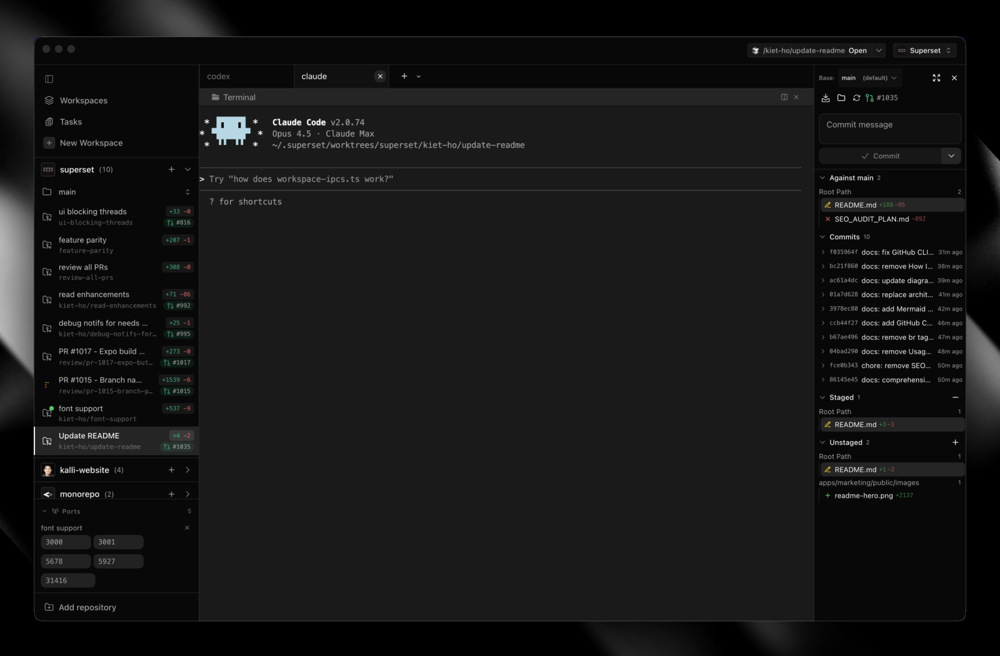

<div align="center">



### AI Agent Orchestration Platform

[](https://github.com/FrankDan77/loop-app/stargazers)
[](https://github.com/FrankDan77/loop-app/releases)
[](LICENSE.md)

<br />

**Loop** is a powerful AI agent orchestration platform that enables developers to run multiple coding agents in parallel with complete isolation and full visibility.

Built on top of [**Superset**](https://github.com/superset-sh/superset), Loop extends the foundation with enhanced workflow automation, improved agent management, and streamlined development experience.

<br />

[**Download for macOS**](https://github.com/FrankDan77/loop-app/releases/latest) &nbsp;&bull;&nbsp; [Changelog](https://github.com/FrankDan77/loop-app/releases)

<br />


</div>

## About This Project

Loop is developed based on [**Superset**](https://github.com/superset-sh/superset) — an open-source multi-agent orchestration framework. We extend Superset's core capabilities with:

- **Enhanced Agent Coordination**: Improved parallel execution and resource management
- **Workflow Automation**: Advanced task scheduling and pipeline orchestration  
- **Developer Experience**: Streamlined setup, better debugging tools, and comprehensive monitoring
- **Custom Integrations**: Extended support for various AI models and development tools

All core features from Superset are preserved and enhanced in Loop. For the original Superset project, visit: https://github.com/superset-sh/superset

## Why Loop?

Loop orchestrates CLI-based coding agents across isolated git worktrees, providing enterprise-grade workflow management with zero context switching overhead.

- **Run multiple agents simultaneously** without context switching overhead
- **Isolate each task** in its own git worktree so agents don't interfere with each other
- **Monitor all your agents** from one place and get notified when they need attention
- **Review and edit changes quickly** with the built-in diff viewer and editor
- **Open any workspace where you need it** with one-click handoff to your editor or terminal
- **Reach your workspaces from anywhere** via remote hosts, the CLI, the SDK, or MCP

## Features

| Feature | Description |
|:--------|:------------|
| **Parallel Execution** | Run 10+ coding agents simultaneously on your machine |
| **Worktree Isolation** | Each task gets its own branch and working directory |
| **Agent Monitoring** | Track every agent from the sidebar, with dock badges when one needs attention |
| **Built-in Terminal** | Tabs, splits, presets, persistent sessions, and an optional rich prompt editor |
| **Built-in Diff Viewer** | Inspect, comment on, and edit agent changes without leaving the app |
| **Command Palette** | Jump to any workspace, action, or setting from one search box |
| **In-App Browser & Ports** | Preview running dev servers, with ports detected per workspace |
| **Remote Workspaces** | Connect another machine and reach its workspaces from anywhere |
| **Automations** | Run agent sessions on a schedule |
| **Custom Agents** | Add your own terminal agents with custom icons |
| **Workspace Presets** | Automate env setup, dependency installation, and more |
| **Slack & Linear** | Spin up workspaces from Slack messages or Linear issues |
| **Universal Compatibility** | Works with any CLI agent that runs in a terminal |
| **IDE Integration** | Open any workspace in your favorite editor with one click |

## Supported Agents

Loop works with any CLI-based coding agent, including:

| Agent | Status |
|:------|:-------|
|  &nbsp;[Claude Code](https://github.com/anthropics/claude-code) | Fully supported |
| <picture><source media="(prefers-color-scheme: dark)" srcset="packages/ui/src/assets/icons/preset-icons/codex-white.svg" /></picture> &nbsp;[OpenAI Codex CLI](https://github.com/openai/codex) | Fully supported |
| <picture><source media="(prefers-color-scheme: dark)" srcset="packages/ui/src/assets/icons/preset-icons/droid-white.svg" /></picture> &nbsp;[Droid](https://www.factory.ai/) | Fully supported |
| <picture><source media="(prefers-color-scheme: dark)" srcset="packages/ui/src/assets/icons/preset-icons/pi-white.svg" /></picture> &nbsp;[Pi](https://github.com/badlogic/pi-mono/tree/main/packages/coding-agent) | Fully supported |
| Any other CLI agent | Works without configuration |

If it runs in a terminal, it runs on Loop

Agents get more than a terminal:

- **Model picker**: choose a model and reasoning effort when you launch an agent
- **Per-agent settings**: tune launch commands, prompt templates, and model overrides in Settings → Agents
- **Custom agents**: add any terminal agent with its own icon and it works like a built-in
- **Status and notifications**: working indicators, completion chimes, and dock badges when an agent needs you
- **Built-in chat**: talk to models in a chat pane, with inline tool approvals and plan review

## More Than a Desktop App

Every surface talks to the same workspaces, so you can start a task in the app and check on it from anywhere.

| Surface | What you get |
|:--------|:-------------|
| [**Desktop App**](https://github.com/FrankDan77/loop-app/releases/latest) | The full IDE: terminals, diff viewer, in-app browser, automations |
| [**CLI**](https://docs.superset.sh/cli/getting-started) | A single `loop` binary to manage workspaces, agents, terminals, and hosts from any shell |
| [**TypeScript SDK**](https://docs.superset.sh/sdk/getting-started) | Drive Loop programmatically with [`@loop/sdk`](https://www.npmjs.com/package/@loop/sdk) from Node, Bun, or Deno |
| [**MCP Server**](https://docs.superset.sh/mcp) | Let Claude Code, Codex, Cursor, and other agents create and manage workspaces themselves |

The CLI comes bundled with the desktop app.

An iOS app is coming soon so you can check on your agents from your phone.

## Requirements

| Requirement | Details |
|:------------|:--------|
| **OS** | macOS (Windows/Linux untested) |
| **Runtime** | [Bun](https://bun.sh/) v1.0+ |
| **Version Control** | Git 2.20+ |
| **GitHub CLI** | [gh](https://cli.github.com/) |
| **Caddy** | [caddy](https://caddyserver.com/docs/install) (for dev server) |

## Install

**[Download Loop for macOS](https://github.com/FrankDan77/loop-app/releases/latest)**

Builds for Windows and Linux are not yet available.

## Development

Want to hack on Loop or contribute a PR? Spin up a local dev environment in one command:

```bash
git clone https://github.com/FrankDan77/loop-app.git
cd loop
./.superset/setup.local.sh
bun run dev
```

No Neon account or third-party credentials needed. `setup.local.sh` brings up a local Postgres + Electric stack via Docker and seeds a dev account. Sign in with the **"Sign in as dev"** button (or `admin@local.test` / `loopdev`).

Prereqs: `bun`, `docker`, `jq`, `caddy` (`brew install jq caddy && caddy trust`).

See [**DEVELOPMENT.md**](./DEVELOPMENT.md) for the full guide: what the setup script does, manual setup against real services, common commands, troubleshooting, and how to build the desktop app. Contribution process lives in [**CONTRIBUTING.md**](./CONTRIBUTING.md).

## Keyboard Shortcuts

All shortcuts are customizable via **Settings > Keyboard Shortcuts** (`⌘/`). See [full documentation](https://docs.superset.sh/keyboard-shortcuts).

### Workspace Navigation

| Shortcut | Action |
|:---------|:-------|
| `⌘1-9` | Switch to workspace 1-9 |
| `⌘⌥↑/↓` | Previous/next workspace |
| `⌘N` | New workspace |
| `⌘⇧N` | Quick create workspace |
| `⌘⇧O` | Open project |

### Terminal

| Shortcut | Action |
|:---------|:-------|
| `⌘T` | New tab |
| `⌘W` | Close pane/terminal |
| `⌘D` | Split right |
| `⌘⇧D` | Split down |
| `⌘K` | Clear terminal |
| `⌘F` | Find in terminal |
| `⌘⌥←/→` | Previous/next tab |
| `Ctrl+1-9` | Open preset 1-9 |

### Layout

| Shortcut | Action |
|:---------|:-------|
| `⌘B` | Toggle workspaces sidebar |
| `⌘L` | Toggle changes panel |
| `⌘O` | Open in external app |
| `⌘⇧C` | Copy path |

## Configuration

Configure workspace setup, teardown, and run scripts in `.loop/config.json`.

```json
{
  "setup": ["./.loop/setup.sh"],
  "teardown": ["./.loop/teardown.sh"],
  "run": ["./.loop/run.sh"]
}
```

| Option | Type | Description |
|:-------|:-----|:------------|
| `setup` | `string[]` | Commands to run when creating a workspace |
| `teardown` | `string[]` | Commands to run when deleting a workspace |
| `run` | `string[]` | Restartable dev-server commands, triggered by the Run button |

### Example setup script

```bash
#!/bin/bash
# .loop/setup.sh

# Copy environment variables
cp ../.env .env

# Install dependencies
bun install

# Run any other setup tasks
echo "Workspace ready!"
```

Scripts have access to environment variables:
- `LOOP_WORKSPACE_NAME`: name of the workspace
- `LOOP_WORKSPACE_PATH`: path to the workspace worktree
- `LOOP_ROOT_PATH`: path to the main repository

## Mastra Dependencies

This repo uses the published upstream `mastracode` and `@mastra/*` packages directly. Avoid adding custom tarball overrides unless there is a repo-specific blocker.

## Tech Stack

<p>
  <a href="https://www.electronjs.org/"></a>
  <a href="https://reactjs.org/"></a>
  <a href="https://tailwindcss.com/"></a>
  <a href="https://bun.sh/"></a>
  <a href="https://turbo.build/"></a>
  <a href="https://vitejs.dev/"></a>
  <a href="https://biomejs.dev/"></a>
  <a href="https://orm.drizzle.team/"></a>
  <a href="https://neon.tech/"></a>
  <a href="https://trpc.io/"></a>
</p>

## Private by Default

- **Source Available**: full source is on GitHub under Elastic License 2.0 (ELv2).
- **Explicit Connections**: you choose which agents, providers, and integrations to connect.

## Contributing

We welcome contributions! See [CONTRIBUTING.md](CONTRIBUTING.md) for how to get set up and open a PR. Bugs and feature requests go in [issues](https://github.com/FrankDan77/loop-app/issues).

<a href="https://github.com/FrankDan77/loop-app/graphs/contributors">
  
</a>

## License

Distributed under the Elastic License 2.0 (ELv2). See [LICENSE.md](LICENSE.md) for more information.
